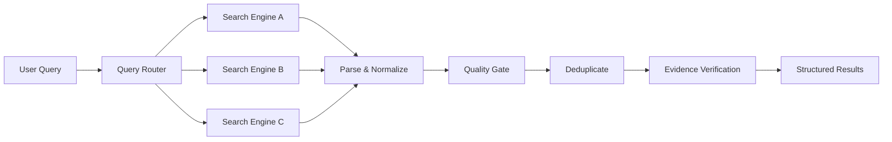

<div align="center">

# 🔎 Multi Search Engine

**Cross-platform multi-engine web search skill for AI agents**

Search the open web through multiple engines, validate result quality, track evidence, and gracefully handle network failures.

[English](README.md) · [简体中文](README_zh-CN.md)

</div>

> A cross-platform web research skill for AI agents — multi-engine search, semantic quality validation, evidence tracking, and graceful failure recovery.


---

## Features

- **Multi-engine search** across Chinese-language and global engines, with automatic routing by query language.
- **`site:` operator support** with real target-domain validation instead of silent degradation.
- **Semantic quality checks** per engine — transport success is never treated as search success.
- **Evidence tracking** with publisher-domain independence, redirect resolution, and claim grading.
- **Failure fallback** across engines for CAPTCHA / 403 / 429 / DNS / SSL / TLS failures.
- **TLS/CA handling** with system CA, `--ca-bundle`, `MSE_CA_BUNDLE`, and optional certifi.
- **Cross-platform** on Windows and Linux, pure Python standard library, zero third-party dependencies.

## Why this project

Most "search" integrations stop at an HTTP 200. That is not a successful search. This skill treats a query as a four-layer funnel:

```
Transport success → Parse success → Semantic success → Evidence verification
```

A request can return `200 OK`, parse into result cards, yet still miss the query intent, ignore a `site:` constraint, or wrap the real destination in an opaque redirect. Only the fourth layer lets you write a sourced claim.

It handles the problems that usually break naive search wrappers:

- Query intent drift and ignored `site:` constraints.
- Noisy result filtering (navigation pages, ads, legal pages, pagination numbers).
- Opaque redirect URL tracking and on-demand original-URL resolution.
- Summary fallback when snippets are missing.
- Search-engine degradation, CAPTCHA, 403, and 429 handling.
- DNS / SSL / TLS failure recovery with fast probing.
- Cross-engine deduplication by canonical URL and publisher domain.
- Publisher-level source independence — two engines finding the same article still count as one source.
- Evidence grading from search snippet (C) to opened / content-verified (A/B).

## Supported search engines

**China / Chinese-language**

- Baidu
- Sogou WeChat (vertical)
- 360 Search (so.com)
- Sogou Web
- Toutiao (vertical)

**Global**

- Bing
- Google
- DuckDuckGo (HTML endpoint)
- Brave Search

> Availability depends on the user's network environment. An engine being supported by the skill does not guarantee it is reachable from every network. A missing engine is a runtime state, not a skill failure.

## Architecture / Workflow



## Quick Start

```bash
git clone https://github.com/luffy666code/multi-search-engine
cd multi-search-engine

# Optional diagnostic (not required before every search)
python scripts/self_check.py

# Search
python scripts/search.py "OpenAI agent research"
```

On Linux, use `python3` instead of `python`:

```bash
python3 scripts/search.py "OpenAI agent research"
```

`self_check.py` is an optional diagnostic tool. It is not required before every search.

## Use with AI Agents

This repository is designed to be dropped into any AI coding agent that can read a markdown contract and run Python. The general manual flow is:

1. Clone the repository.
2. Make `SKILL.md` available to the agent.
3. Allow the agent to execute Python scripts in `scripts/`.
4. Instruct the agent to treat `SKILL.md` as the primary operating contract.

### Generic Agent / Manual Setup

```text
Use this repository as a reusable web-research skill.
First read SKILL.md. Treat scripts/search.py as the primary executable entry point.
Use references/ only when the corresponding detailed rule is needed.
Preserve evidence metadata and do not convert transport success into semantic success.
```

### OpenAI Codex

Manual repository usage: clone the repo, then give Codex the skill instructions:

```text
Read SKILL.md in this repository and follow it as the operating contract for web research.
Use scripts/search.py as the primary search entry point.
Do not treat HTTP success as search success. Apply semantic quality checks and evidence validation before drawing conclusions.
```

### Claude Code

Manual repository usage: place the repository where your project can read it, then:

```text
Read ./SKILL.md before starting the research task.
Follow the routing, quality, fallback, and evidence rules defined there.
Use ./scripts/search.py instead of writing ad-hoc search scripts unless the provided tooling cannot satisfy the task.
```

### DeepSeek Harness (DSH)

Manual repository usage: clone the repo into your workspace and point the harness at `SKILL.md` as the agent operating contract, allowing execution of `scripts/`.

```text
Use this repository as a reusable web-research skill.
First read SKILL.md. Treat scripts/search.py as the primary executable entry point.
Use references/ only when the corresponding detailed rule is needed.
Preserve evidence metadata and do not convert transport success into semantic success.
```

### Gemini CLI

Manual repository usage: clone the repo, then add the generic prompt above to your Gemini CLI context or `GEMINI.md`, instructing it to read `SKILL.md` and use `scripts/search.py`.

### Cursor

Manual repository usage: clone the repo into your project workspace, then add the generic prompt above to your project rules (e.g. `.cursor/rules`), instructing the agent to read `SKILL.md` and run `scripts/search.py` instead of writing ad-hoc scraping code.

> The install commands above are manual repository usage. Where a vendor does not yet document an official one-line install for this skill, manual setup is used rather than inventing a command.

## Usage Examples

See the [`examples/`](examples/) directory:

- [Basic search](examples/basic-search.md)
- [Site-restricted search](examples/site-search.md)
- [End-to-end research workflow](examples/research-workflow.md)

## Output & Evidence

Each run writes an isolated directory under `temp_search/runs/<run-id>/` with raw responses, a run manifest, merged `results.json`, a human-readable `results-preview.md`, and `evidence.json`.

Every result carries evidence metadata: `url_state`, `publisher_domain`, `summary_state`, `intent_status`, `source_grade` (A/B/C), and `verification_state`. Search candidates start at grade C and are only upgraded when the original source is actually opened and verified.

Full schema: [`references/evidence-schema.md`](references/evidence-schema.md).

## Network / TLS notes

TLS verification is strict by default and uses, in order: system CA, `--ca-bundle`, the `MSE_CA_BUNDLE` environment variable, and optional certifi.

- `--ca-bundle <path>`: point at a custom CA bundle.
- `MSE_CA_BUNDLE`: same idea via environment variable.
- `--allow-insecure-fallback`: one-time fallback only when certificate validation is unavailable, always recorded in the run manifest.
- `--insecure`: do not use as a default. It disables certificate verification and should only be used for a deliberate, documented test.

```bash
python scripts/search.py "query" --ca-bundle /path/to/ca.pem
```

More detail on CAPTCHA, 403/429, DNS/SSL/TLS, and fallback: [`references/reliability-and-fallback.md`](references/reliability-and-fallback.md).

## Project Structure

```
multi-search-engine/
├── SKILL.md                  # Primary operating contract for agents
├── CHANGELOG.md
├── LICENSE                   # MIT
├── Skillicon.png
├── README.md
├── README_zh-CN.md
├── examples/
│   ├── basic-search.md
│   ├── site-search.md
│   └── research-workflow.md
├── references/
│   ├── evidence-schema.md
│   ├── linux-execution.md
│   ├── query-strategy.md
│   ├── reliability-and-fallback.md
│   ├── search-sources.md
│   └── windows-execution.md
└── scripts/
    ├── cleanup.py
    ├── engine_catalog.py
    ├── fetch.py
    ├── parse.py
    ├── quality.py
    ├── resolve_link.py
    ├── runtime.py
    ├── search.py             # Primary entry point
    ├── self_check.py         # Optional diagnostic
    ├── show.py
    └── url_safety.py
```

## Troubleshooting

- **403 / 429 / CAPTCHA from an engine**: the engine is rate-limited or challenged. The skill records it and moves to another engine; do not retry aggressively or try to bypass the challenge.
- **DNS / SSL / TLS errors**: usually a network or CA issue. Use `--ca-bundle` or `MSE_CA_BUNDLE`; only reach for `--insecure` as a deliberate test.
- **`site:` results do not actually match the target domain**: the skill returns `semantic_ok=false` / `site-intent-unsatisfied`. Do not silently accept results from a different domain.
- **Chinese-language queries return nothing or irrelevant results**: some global engines may be geo-redirected (e.g. `www.bing.com` → `cn.bing.com`). `geo_localized` is recorded; the result is a localized recall, not international coverage.

## Acknowledgements

This project evolved from the open-source multi-search-engine skill and has since been substantially extended with cross-platform execution, semantic quality validation, evidence tracking, failure recovery, and global search support.

## License

[MIT](LICENSE)
