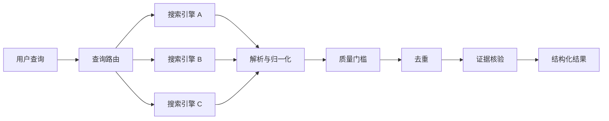

<div align="center">

# 🔎 Multi Search Engine

**面向 AI Agent 的跨平台多引擎网页检索 Skill**

通过多个搜索引擎检索公开网络，校验结果质量、留痕证据，并优雅处理网络失败。

[English](README.md) · [简体中文](README_zh-CN.md)

</div>

> 面向 AI Agent 的跨平台网页研究 Skill —— 多引擎检索、语义质量校验、证据留痕与失败自愈。


---

## 特性

- **多引擎检索**：同时覆盖中文与国际搜索引擎，按查询语言自动路由。
- **支持 `site:` 操作符**：真正校验目标域名命中，而不是静默降级。
- **逐引擎语义质量校验**：绝不把"HTTP 200"当作检索成功。
- **证据留痕**：按发布方域名计算来源独立性，解析重定向，并对结论分级。
- **失败自愈**：遇到验证码 / 403 / 429 / DNS / SSL / TLS 失败时自动切换其他引擎。
- **TLS / CA 处理**：支持系统 CA、`--ca-bundle`、`MSE_CA_BUNDLE` 和可选 certifi。
- **跨平台**：Windows 与 Linux 均可运行，纯 Python 标准库，零第三方依赖。

## 为什么需要这个项目

大多数"搜索"集成只做到 HTTP 200 就停了。那不算一次成功的检索。本 Skill 把一次查询当作四层漏斗：

```
传输成功 → 解析成功 → 语义成功 → 证据核验
```

一次请求完全可能返回 `200 OK`、解析出结果卡片，却根本没命中查询意图、忽略了 `site:` 约束，或把真实目标包在一个不透明跳转后面。只有走完第四层，你写出的结论才有来源支撑。

它处理的正是朴素搜索封装常翻车的问题：

- 查询意图漂移、`site:` 约束被忽略。
- 噪音过滤（导航页、广告、法务页、分页数字）。
- 不透明跳转追踪，按需解析原始链接。
- 摘要缺失时的兜底生成。
- 搜索引擎降级、验证码、403、429 处理。
- DNS / SSL / TLS 失败后的快速探测与换源。
- 跨引擎按 canonical URL 和发布方域名去重。
- 发布方层面的来源独立性 —— 两个引擎搜到同一篇文章仍只算一个来源。
- 证据分级：从搜索摘要（C 级）到打开原文核验（A/B 级）。

## 支持的搜索引擎

**中文 / 国内**

- 百度
- 搜狗微信（垂直）
- 360 搜索（so.com）
- 搜狗网页
- 今日头条（垂直）

**国际**

- Bing
- Google
- DuckDuckGo（HTML 端点）
- Brave Search

> 可用性取决于用户所在的网络环境。Skill 支持某个引擎，并不代表它在任何网络下都可达。某个引擎不可用是运行时状态，不是 Skill 失败。

## 架构 / 工作流



## 快速开始

```bash
git clone https://github.com/luffy666code/multi-search-engine
cd multi-search-engine

# 可选诊断（不是每次检索前都必须跑）
python scripts/self_check.py

# 检索
python scripts/search.py "OpenAI agent research"
```

在 Linux 上请用 `python3` 代替 `python`：

```bash
python3 scripts/search.py "OpenAI agent research"
```

`self_check.py` 是可选诊断工具，不是每次检索前的必跑步骤。

## 与 AI Agent 配合使用

这个仓库可以直接接入任何"能读 markdown 契约、能跑 Python"的 AI 编码 Agent。通用手动接入流程：

1. Clone 仓库。
2. 把 `SKILL.md` 提供给 Agent。
3. 允许 Agent 执行 `scripts/` 下的 Python 脚本。
4. 指示 Agent 把 `SKILL.md` 当作首要操作契约。

### 通用 Agent / 手动接入

```text
Use this repository as a reusable web-research skill.
First read SKILL.md. Treat scripts/search.py as the primary executable entry point.
Use references/ only when the corresponding detailed rule is needed.
Preserve evidence metadata and do not convert transport success into semantic success.
```

### OpenAI Codex

手动接入：clone 仓库后，给 Codex 如下指令：

```text
Read SKILL.md in this repository and follow it as the operating contract for web research.
Use scripts/search.py as the primary search entry point.
Do not treat HTTP success as search success. Apply semantic quality checks and evidence validation before drawing conclusions.
```

### Claude Code

手动接入：把仓库放到项目可读取的位置，然后：

```text
Read ./SKILL.md before starting the research task.
Follow the routing, quality, fallback, and evidence rules defined there.
Use ./scripts/search.py instead of writing ad-hoc search scripts unless the provided tooling cannot satisfy the task.
```

### DeepSeek Harness（DSH）

手动接入：把仓库 clone 到你的工作区，将 `SKILL.md` 作为 Agent 操作契约指向给 Harness，并允许执行 `scripts/`。

```text
Use this repository as a reusable web-research skill.
First read SKILL.md. Treat scripts/search.py as the primary executable entry point.
Use references/ only when the corresponding detailed rule is needed.
Preserve evidence metadata and do not convert transport success into semantic success.
```

### Gemini CLI

手动接入：clone 仓库后，把上面的通用 Prompt 写进你的 Gemini CLI 上下文或 `GEMINI.md`，让它先读 `SKILL.md` 并使用 `scripts/search.py`。

### Cursor

手动接入：把仓库 clone 到项目工作区，再把上面的通用 Prompt 写进项目规则（例如 `.cursor/rules`），让 Agent 先读 `SKILL.md` 并运行 `scripts/search.py`，而不是临时写爬虫脚本。

> 以上均为手动仓库接入方式。若某厂商尚未提供针对本 Skill 的官方一键安装命令，这里一律用手动方式，不编造不存在的命令。

## 使用示例

详见 [`examples/`](examples/) 目录：

- [基础检索](examples/basic-search.md)
- [site: 限定检索](examples/site-search.md)
- [端到端研究流程](examples/research-workflow.md)

## 输出与证据

每次检索都会在 `temp_search/runs/<run-id>/` 下写入独立目录，包含原始响应、运行清单、合并后的 `results.json`、人类可读的 `results-preview.md` 和 `evidence.json`。

每条结果都携带证据元数据：`url_state`、`publisher_domain`、`summary_state`、`intent_status`、`source_grade`（A/B/C）、`verification_state`。搜索候选一律从 C 级开始，只有真正打开原文并核验后才会升级。

完整 schema：[`references/evidence-schema.md`](references/evidence-schema.md)。

## 网络 / TLS 说明

TLS 默认严格校验，依次使用：系统 CA、`--ca-bundle`、`MSE_CA_BUNDLE` 环境变量、可选 certifi。

- `--ca-bundle <path>`：指定自定义 CA 包。
- `MSE_CA_BUNDLE`：通过环境变量指定。
- `--allow-insecure-fallback`：仅在证书校验不可用时一次性降级，并写入运行清单。
- `--insecure`：不要作为默认方案。它会关闭证书校验，只应在明确知情的测试中使用。

```bash
python scripts/search.py "query" --ca-bundle /path/to/ca.pem
```

验证码、403/429、DNS/SSL/TLS 与失败降级的更多细节：[`references/reliability-and-fallback.md`](references/reliability-and-fallback.md)。

## 项目结构

```
multi-search-engine/
├── SKILL.md                  # Agent 的首要操作契约
├── CHANGELOG.md
├── LICENSE                   # MIT
├── Skillicon.png
├── README.md
├── README_zh-CN.md
├── examples/
│   ├── basic-search.md
│   ├── site-search.md
│   └── research-workflow.md
├── references/
│   ├── evidence-schema.md
│   ├── linux-execution.md
│   ├── query-strategy.md
│   ├── reliability-and-fallback.md
│   ├── search-sources.md
│   └── windows-execution.md
└── scripts/
    ├── cleanup.py
    ├── engine_catalog.py
    ├── fetch.py
    ├── parse.py
    ├── quality.py
    ├── resolve_link.py
    ├── runtime.py
    ├── search.py             # 主入口
    ├── self_check.py         # 可选诊断
    ├── show.py
    └── url_safety.py
```

## 常见问题

- **某引擎返回 403 / 429 / 验证码**：该引擎被限流或挑战。Skill 会记录并切换其他引擎，不要连续重试或尝试绕过。
- **DNS / SSL / TLS 报错**：通常是网络或 CA 问题。用 `--ca-bundle` 或 `MSE_CA_BUNDLE`；`--insecure` 只应作为明确知情的测试手段。
- **`site:` 结果实际不匹配目标域名**：Skill 会返回 `semantic_ok=false` / `site-intent-unsatisfied`，不要静默接受其他域名的结果。
- **中文查询返回空或无关结果**：部分国际引擎可能被地区重定向（如 `www.bing.com` → `cn.bing.com`）。此时会记录 `geo_localized`，结果属于本地化召回，不能当作国际覆盖。

## 致谢

本项目源自开源的 multi-search-engine Skill，并在此基础上大幅扩展了跨平台执行、语义质量校验、证据留痕、失败自愈和全球检索支持。

## 许可证

[MIT](LICENSE)
